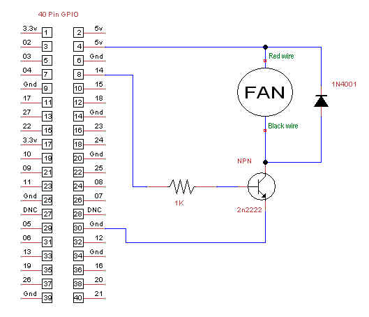

# Pi Fan Controller

Raspberry Pi fan controller.

## Control circuit

* transistor: 2n2222
* resistor: 1K 
* diode: 1N4001

## Description

This repository provides scripts that can be run on the Raspberry Pi that will
monitor the core temperature and start the fan when the temperature reaches
a certain threshold.

To use this code, you'll have to install a fan. The full instructions can be
found on our guide: [Control Your Raspberry Pi Fan (and Temperature) with Python](https://howchoo.com/g/ote2mjkzzta/control-raspberry-pi-fan-temperature-python).
